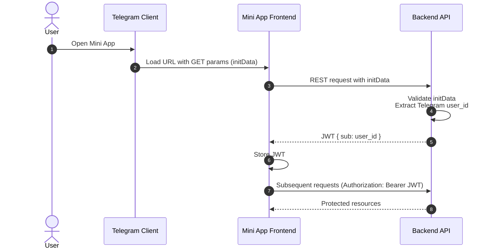

# Аутентификация

## Необходимый контекст

- Telegram Mini App init data https://docs.telegram-mini-apps.com/platform/init-data, https://docs.telegram-mini-apps.com/platform/launch-parameters
- JWT (структура, подпись, claims) - https://auth0.com/docs/secure/tokens/json-web-tokens

## Флоу авторизации

Так как основным фронтенд клиентом проекта является Telegram Mini App, бэкенд авторизует пользователей через Telegram.

1. Пользователь открывает Telegram Mini App.
2. Telegram клиент встраивает в адрес Mini App страницы GET параметры, содержащие в себе init data. Init data включает в себя информацию о том, какой именно пользователь открыл Mini App.
3. Код фронтенда Mini App извлекает init data из GET параметров, и отправляет на бэкенд.
4. Бэкенд валидирует init data, чтобы удостовериться в её оригинальности, и извлекает Telegram id пользователя.
5. Бэкенд генерирует JWT токен, в котором зашит Telegram id пользователя.
6. Фронтенд запоминает JWT токен и подписывает им дальнейшие запросы.

Шаги в виде sequence диаграммы:

# Авторизация

В REST API приложения подразумевается разграничение доступа к различным эндпоинтам в зависимости от роли пользователя. Пример - эндпоинты с админским функционалом.

При генерации JWT токена, бэкенд определяет роль пользователя, опираясь на записи в БД, и включает роли пользователя в claims выдаваемого токена.
