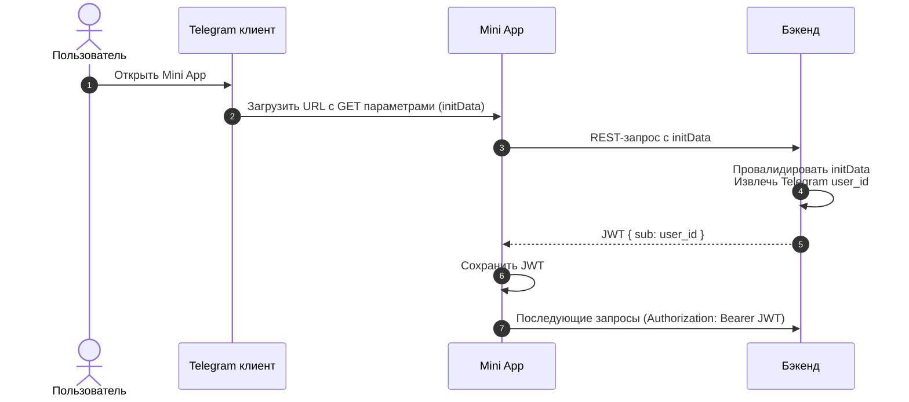

# Бизнес аналитика - аутентификация

## Необходимый контекст

- Telegram Mini App init data https://docs.telegram-mini-apps.com/platform/init-data, https://docs.telegram-mini-apps.com/platform/launch-parameters
- JWT (структура, подпись, claims) - https://auth0.com/docs/secure/tokens/json-web-tokens

## Аутентификация через Telegram

Так как основным фронтенд клиентом проекта является Telegram Mini App, бэкенд авторизует пользователей через Telegram.

1. Пользователь открывает Telegram Mini App.
2. Telegram клиент встраивает в адрес Mini App страницы GET параметры, содержащие в себе init data. Init data включает в себя информацию о том, какой именно пользователь открыл Mini App.
3. Код фронтенда Mini App извлекает init data из GET параметров, и отправляет на бэкенд.
4. Бэкенд валидирует init data, чтобы удостовериться в её оригинальности, и извлекает Telegram id пользователя.
5. Бэкенд генерирует JWT токен, subject'ом которого является user id (в нашей БД, не в Telegram).
6. Фронтенд запоминает JWT токен и подписывает им дальнейшие запросы.

Шаги в виде sequence диаграммы:

## Dummy авторизация

Авторизация через Telegram init data не очень удобна при локальном тестировании REST API. Для вызова метода авторизации нам необходимо знать init data, что требует наличия Telegram клиента с запущенным Mini App. Без вызова метода авторизации нам не получить токены, необходимые для вызова всех эндпоинтов, которые недоступны неавторизованным пользователям.

Для контекста - такой проблемы нет при тестировании авторизации по логину и паролю, потому что мы всегда можем передать пару этих значений в метод авторизации, и получить токены.

Для удобства локального тестирования необходимо иметь второй, доступный только в тестовых окружениях, метод авторизации, который выдаёт токены для любого запрошенного пользователя. Далее в документации данный метод авторизации будет называться "dummy auth".

Это позволит облегчить тестирование, разработку и бэкенда и фронтенда.

## Бизнес требования

- Реализовать авторизацию через Telegram init data.
- Реализовать Dummy авторизацию.

# Бизнес аналитика - авторизация

В REST API приложения подразумевается разграничение доступа к различным эндпоинтам в зависимости от роли пользователя. Пример - эндпоинты с админским функционалом.

При генерации JWT токена, бэкенд определяет роль пользователя, опираясь на записи в БД, и включает роли пользователя в claims выдаваемого токена.

## Бизнес требования

- Реализовать механизм присвоения ролей токену при его генерации.
