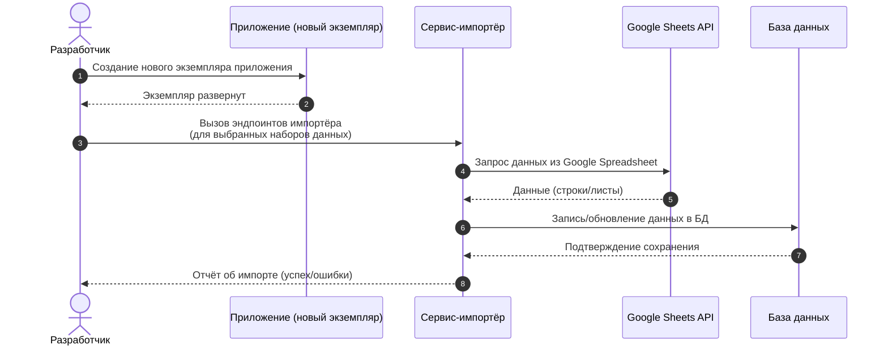

# Импорт данных

## Необходимый контекст

- [Статья](https://zhukovsd.it/posts/project-recording-automation/) о том, как на сентрябрь 2025 работает учёт проектов и ревью с помощью бота сообщества.
- Google Spreadsheet API - https://developers.google.com/workspace/sheets/api/guides/concepts
- [Таблица](https://docs.google.com/spreadsheets/d/1E66YrdvO7B_j0Ykge-JJDMtB1RfKhIzN_SsO7UPDbrU) членов, проектов и ревью сообщества.
- [Таблица](https://docs.google.com/spreadsheets/d/1_EaS3CRoBeo-PG04O2YGOYSk3afdGxgeqd3x0WRLe68/edit?gid=0#gid=0) менторов (менторы, услуги), [таблица](https://docs.google.com/spreadsheets/d/1DkIIcE6oUtcK9jjfrOyUgatb6DIxL5GXEn3kvUp4Lms) гарантированных ревью (менторы, цены).

## Наполнение экземпляра приложения данными

Суть - любое приложение требует данных для функционирования, иначе оно кажется пустым и мёртвым.

У нас уже есть данные, но они вне приложения (в Google Spreadsheet таблицах). Суть задачи - обеспечить наполнение экземпляра приложения данными, импортированными из Google таблиц.

Это облегчит локальную разработку и тестирование, а так же придаст начальный импульс активности реальных пользователей.

Набор импортируемых данных зависит от доступного в приложении функционала. На уровне работы с пользователями и авторизацией мы можем импортировать пользователей, на уровне реализации коллекции проектов - проекты, и так далее.

## Сервис-импортер

За импорт данных отвечает бэкенд сервис-импортер. Интерфейс взаимодействия с ним - REST. Вызов эндпоинтов сервиса требует роли "admin".

## Флоу наполнения приложения данными

1. Разработчик - создание нового экземпляра приложения.
2. Разработчик - вызов эндпоинтов сервиса-импортера, отвечающих за определённый набор данных.
3. Сервис-импортер запрашивает данные у Google Spreadsheet API и наполняет БД приложения.

## Импорт аккаунтов студентов

[Таблица](https://docs.google.com/spreadsheets/d/1E66YrdvO7B_j0Ykge-JJDMtB1RfKhIzN_SsO7UPDbrU/edit?gid=1733656936#gid=1733656936) "IT Ментор | Проекты и ревью", лист "Студенты".

Лист содержит список авторов проектов, идентифицированных ссылкой на GitHub аккаунт.

Бот сообщества при сборе проектов не фиксирует телеграм аккаунт автора, список связей между GitHub и Telegram аккаунтом перечислен на отдельном листе "Telegram аккаунты студентов".

Итого, импортируемые значения:
- Telegram id.
- Роль "student".

Импорт данных профиля (GitHub аккаунт) реализуется отдельно.

## Бизнес требования

- Реализовать сервис-импортер с REST эндпоинтами, запускающими импорт данных запрошенного типа
