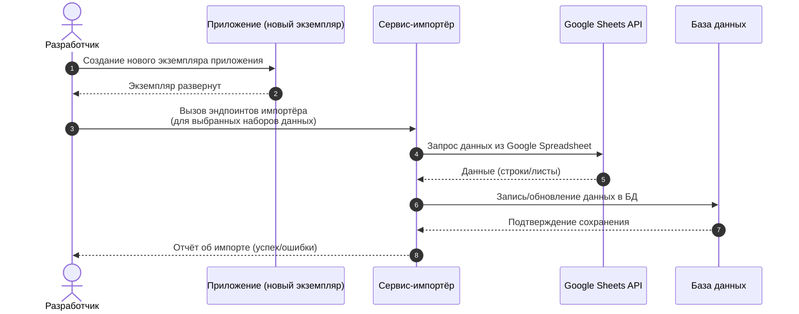

# Бизнес аналитика - импорт данных

## Необходимый контекст

- [Статья](https://zhukovsd.it/posts/project-recording-automation/) о том, как на сентрябрь 2025 работает учёт проектов и ревью с помощью бота сообщества.
- Google Spreadsheet API - https://developers.google.com/workspace/sheets/api/guides/concepts
- [Таблица](https://docs.google.com/spreadsheets/d/1E66YrdvO7B_j0Ykge-JJDMtB1RfKhIzN_SsO7UPDbrU) членов, проектов и ревью сообщества.
- [Таблица](https://docs.google.com/spreadsheets/d/1_EaS3CRoBeo-PG04O2YGOYSk3afdGxgeqd3x0WRLe68/edit?gid=0#gid=0) менторов (менторы, услуги), [таблица](https://docs.google.com/spreadsheets/d/1DkIIcE6oUtcK9jjfrOyUgatb6DIxL5GXEn3kvUp4Lms) гарантированных ревью (менторы, цены).

## Наполнение экземпляра приложения данными

Суть - любое приложение требует данных для функционирования, иначе оно кажется пустым и мёртвым.

У нас уже есть данные, но они вне приложения (в Google Spreadsheet таблицах). Суть задачи - обеспечить наполнение экземпляра приложения данными, импортированными из Google таблиц.

Это облегчит локальную разработку и тестирование, а так же придаст начальный импульс активности реальных пользователей.

Набор импортируемых данных зависит от доступного в приложении функционала. На уровне работы с пользователями и авторизацией мы можем импортировать пользователей, на уровне реализации коллекции проектов - проекты, и так далее.

## Сервис-импортер

За импорт данных отвечает бэкенд сервис-импортер. Интерфейс взаимодействия с ним - REST. Вызов эндпоинтов сервиса требует роли "admin".

## Флоу наполнения приложения данными

1. Разработчик - создание нового экземпляра приложения.
2. Разработчик - вызов эндпоинтов сервиса-импортера, отвечающих за определённый набор данных.
3. Сервис-импортер запрашивает данные у Google Spreadsheet API и наполняет БД приложения.

```mermaid
sequenceDiagram
autonumber
actor Dev as Разработчик
participant App as Приложение (новый экземпляр)
participant Imp as Сервис-импортёр
participant GSA as Google Sheets API
participant DB as База данных

Dev->>App: Создание нового экземпляра приложения
App-->>Dev: Экземпляр развернут

Dev->>Imp: Вызов эндпоинтов импортёра<br/>(для выбранных наборов данных)
Imp->>GSA: Запрос данных из Google Spreadsheet
GSA-->>Imp: Данные (строки/листы)

Imp->>DB: Запись/обновление данных в БД
DB-->>Imp: Подтверждение сохранения
Imp-->>Dev: Отчёт об импорте (успех/ошибки)
```

## Импорт аккаунтов студентов

[Таблица](https://docs.google.com/spreadsheets/d/1E66YrdvO7B_j0Ykge-JJDMtB1RfKhIzN_SsO7UPDbrU/edit?gid=1733656936#gid=1733656936) "IT Ментор | Проекты и ревью", лист "Студенты".

Лист содержит список авторов проектов, идентифицированных ссылкой на GitHub аккаунт.

Бот сообщества при сборе проектов не фиксирует телеграм аккаунт автора, список связей между GitHub и Telegram аккаунтом перечислен на отдельном листе "Telegram аккаунты студентов".

Итого, импортируемые значения:
- Telegram id.
- Роль "student".

Импорт данных профиля (GitHub аккаунт) реализуется отдельно.

## Импорт профилей студентов

[Таблица](https://docs.google.com/spreadsheets/d/1E66YrdvO7B_j0Ykge-JJDMtB1RfKhIzN_SsO7UPDbrU/edit?gid=1733656936#gid=1733656936) "IT Ментор | Проекты и ревью", лист "Telegram аккаунты студентов".

Лист содержит информацию о GitHub и Telegram профилях.

Импортируемые значения:
- Telegram username.
- GitHub account url.

## Импорт менторов

[Таблица](https://docs.google.com/spreadsheets/d/1_EaS3CRoBeo-PG04O2YGOYSk3afdGxgeqd3x0WRLe68/edit?gid=0#gid=0) "IT Ментор | Сергей Жуков | Таблица менторов"

Импортируемые значения:
- Telegram user id ментора (колонка L)
- Telegram username ментора
- Описание (description, колонка H)
- Языки программирования
- Услуги
- Имя

## Импорт гарантированных ревью

[Таблица](https://docs.google.com/spreadsheets/d/1DkIIcE6oUtcK9jjfrOyUgatb6DIxL5GXEn3kvUp4Lms/edit?gid=0#gid=0) "IT Ментор | Гарантированные ревью".

Лист содержит информацию о том, какие менторы и по каким ценам делают ревью.

Импортируемые значения:
- Ментор
- Язык, на котором ментор ревьюит проект
- Цена на конкретный проект

Пример одной импортируемой записи - Алексей @Raketa4000az, Java, Hangman, 15$. Если ментор делает ревью на двух проектах, на двух языках каждый - записи получится 4.

## Импорт вопросов для интервального повторения

У сообщества в данный момент 2 методички - [Java](https://zhukovsd.github.io/java-backend-interview-prep/), [Python](https://zhukovsd.github.io/python-backend-interview-prep/).

Вопросы из методички доступны к импорту из Google Spreadsheet таблиц, из которых генерируются и сами сайты методичек.

Доступ к таблицам предоставляется по запросу.

Структура:
- Лист "Сводный лист" - список вопросов по категориям с популярностью каждого. Вопросы сгруппированы по категориям, у каждой есть заголовок
- Листы "Ответы - %категория%" содержат ответы на вопросы из данной категории. Например "Ответы - Java Core"
- У вопросов нет уникального перманентного идентификатора. Колонка "Unique ID" не должна вводить в заблуждение - это просто нумерация вопросов от 1 до N. В случае изменения порядка вопросов, айди может поменяться, поэтому данное значение не является перманентным.
- Будем считать что уникальным идентификатором вопроса является его формулировка

Между Java / Python методичками могут дублироваться названия категорий.

Импорт вопросов и категорий подразумевается через UPSERT.

- Если у вопроса изменилась формулировка, мы не сможем узнать об этом без перманентного уникального id, поэтому придется создать новый вопрос
- Если формулировка не меняется, то правки ответа, категории вопроса приводят к update ранее существующей записи

Для мягкого удаления неактуальных вопросов подразумевается скрытие вопроса из списка в рамках категории. Причина - на вопрос может быть завязаны записи в дочерних таблицах, поэтому мы не можем просто удалить его. В вопросов в БД должен быть атрибут "enabled", который равен true по-умолчанию, но может быть установлен в false (в планируемом будущем админском функционале для ручного управления вопросами).

## Бизнес требования

- Реализовать сервис-импортер с REST эндпоинтами, запускающими импорт данных запрошенного типа 
