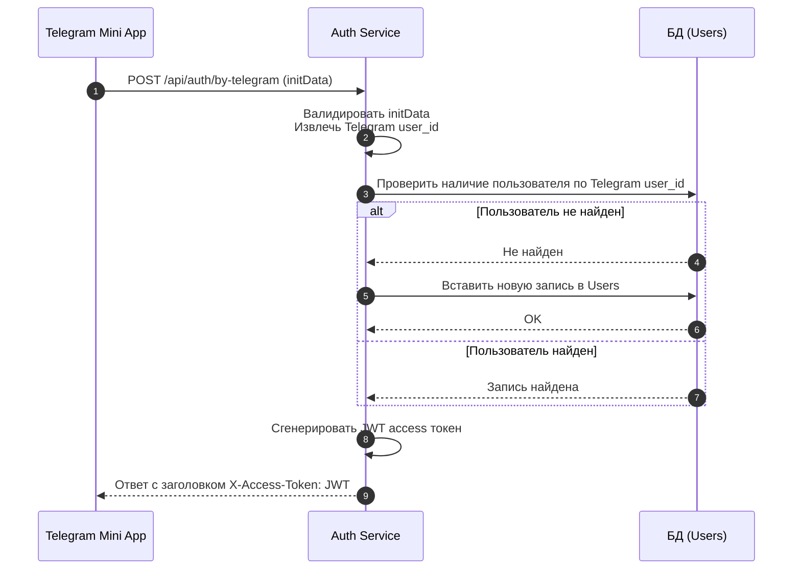

# Системная аналитика - аутентификация и авторизация

## Аутентификация через Telegram

### Необходимый контекст

- Telegram Mini App init data https://docs.telegram-mini-apps.com/platform/init-data, https://docs.telegram-mini-apps.com/platform/launch-parameters
- JWT (структура, подпись, claims) - https://auth0.com/docs/secure/tokens/json-web-tokens
- [Бизнес аналитика](../../business-analytics/functionality/authentication-and-authorization.md) аутентификации и авторизации
- [Описание](../services/auth-service/index.md) Auth Service - стек, схемы БД и REST API

### Шаги

- `POST /api/auth/by-telegram`, тело содержит `initDataRaw`.
- Auth Service валидирует initData, извлекает Telegram user id.
- По Telegram user id проверяем в таблице `Users` существование пользователя в БД.
- Если не существует - вставляем запись.
- Генерируем JWT access токен, устанавливаем в заголовок ответа `X-Access-Token`.

Подробнее про требования к эндпоинту `/api/auth/by-telegram` в [описании](../services/auth-service/index.md) Auth Service.

### Требования

- Работа эндпоинта `/api/auth-by-telegram` соответствует описанному формату и покрыта ручными `.http` тестами - успешный и все неуспешные сценарии.
- Ключ Telegram бота для валидации задаётся через конфиг в `application.yaml` файле. Значение конфигурационного ключа берётся из переменной окружения.
- Время жизни JWT токена устанавливается через конфиг. Значение по-умолчанию - 30 минут.
- Секретный ключ для подписи JWT токена устанавливается через конфиг в Auth Service.
- Валидация подписи покрыта юнит тестами.

## Dummy аутентификация

### Шаги

- `POST /api/auth/by-dummy`, тело содержит `user_id` (не телеграм!) и `roles`.
- Auth Service проверяет существование пользователя. Если не существует  - возвращаем `404 Not Found`.
- Генерируем JWT access токен, устанавливаем в заголовок ответа `X-Access-Token`.

Подробнее про требования к эндпоинту `/api/auth/by-dummy` в [описании](../services/auth-service/index.md) Auth Service.

### Требования

- Работа эндпоинта `/api/auth-by-dummy` соответствует описанному формату и покрыта ручными `.http` тестами - успешный и все неуспешные сценарии.
- Время жизни JWT токена устанавливается через конфиг (тот же что для аутентификации через Telegram). Значение по-умолчанию - 30 минут.
- Эндпоинт `/api/auth-by-dummy` недоступен, если приложение запущено с профилем `prod`.

---

## Авторизация

### Необходимый контекст

- Telegram Mini App init data https://docs.telegram-mini-apps.com/platform/init-data, https://docs.telegram-mini-apps.com/platform/launch-parameters
- JWT (структура, подпись, claims) - https://auth0.com/docs/secure/tokens/json-web-tokens
- [Бизнес аналитика](../../business-analytics/functionality/authentication-and-authorization.md) аутентификации и авторизации
- [Описание](..services/gateway/index.md) Gateway - стек, маршруты, Security

### Шаги

- Gateway принимает запрос на адрес `/api/**`.
- Gateway валидирует подпись и дату истечения JWT токена, извлекает из него user id и роли и складывает их в кастомные заголовки запроса к микросервису -  `X-Telegram-User-Id` и `X-User-Roles`.
- Gateway проксирует запрос в соответствии с маршрутами.

### Требования

- Маршруты соответствуют спецификации из документации Gateway сервиса.
- `403 Forbidden` при запросам к `/api/${service}/internal/**` эндпоинтам.
- Секретный ключ для подписи JWT токена устанавливается через конфиг в Auth Service.
- Telegram User Id и роли передаются микросервисам в заголовках запросов.
- Валидация проверяет корректность подписи и факт истечения.
- Валидация покрыта юнит тестами.
