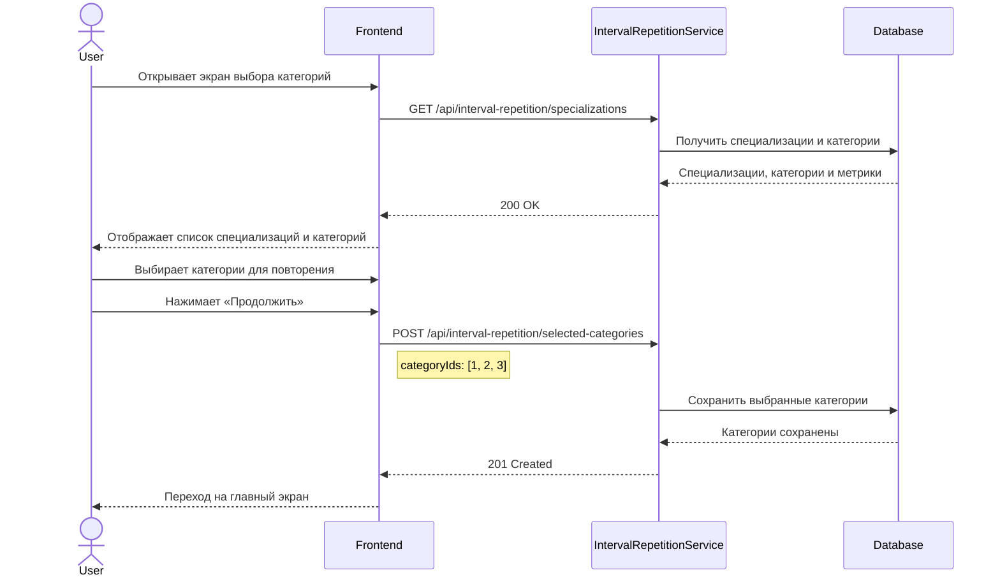
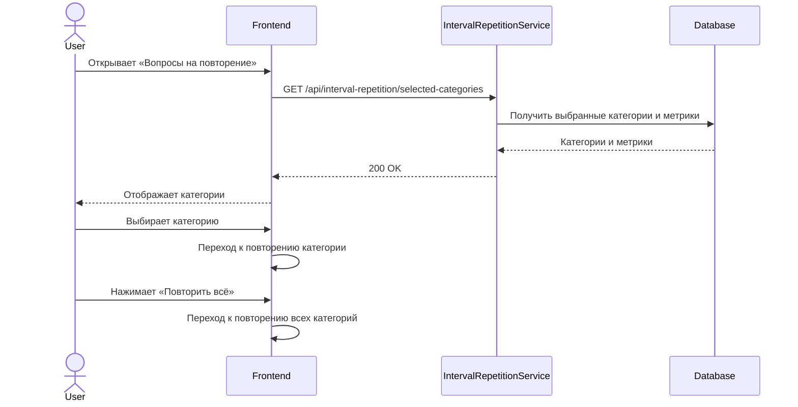
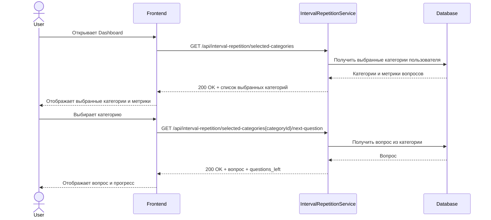
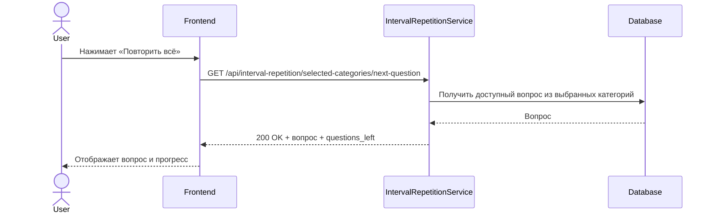
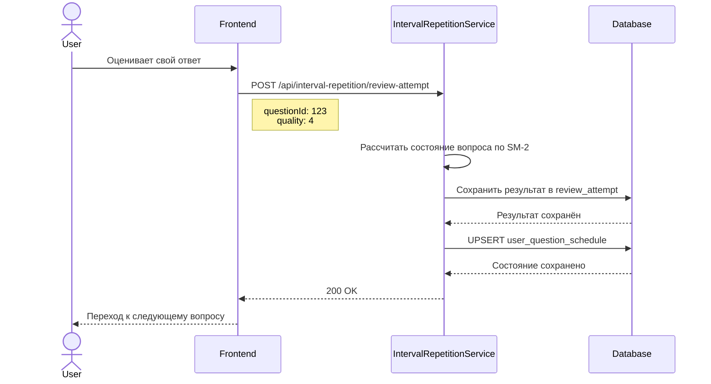
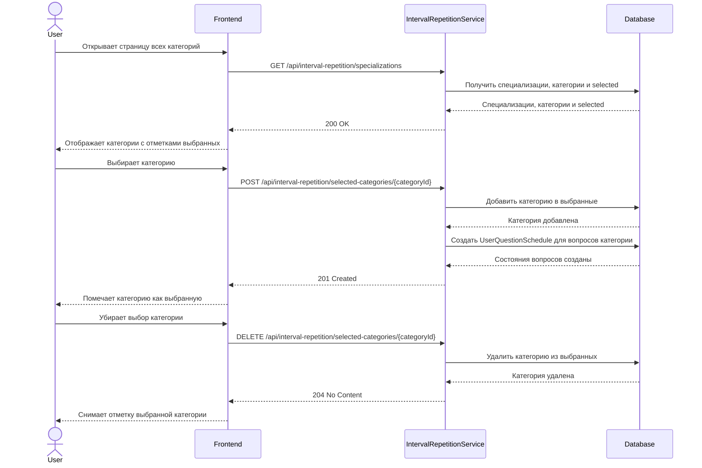
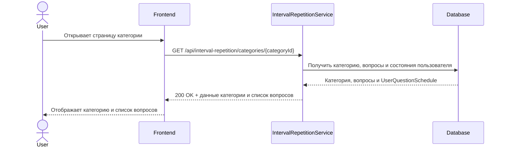

# Системная аналитика - интервальное повторение вопросов для собеседований
## Необходимый контекст

- [Бизнес аналитика - интервальное повторение][(https://github.com/it-mentor-community-platform/meta/blob/main/business-analytics/functionality/data-import.md](https://github.com/it-mentor-community-platform/meta/blob/main/business-analytics/functionality/interview-questions-interval-repetition.md))

## Инициализация

### Шаги

- Пользователь заходит в раздел «Интервальное повторение»
- Пользователю отображается список всех специализаций и категорий
- Пользователь нажимает «Добавить на повторение»
- Категория добавляется в список категорий пользователя, выбранных для повторения




## Вопросы на повторение

### Шаги

- Пользователь заходит в раздел «Вопросы на повторение»
- Отображается список категорий, ранее добавленных пользователем на повторение
- Для каждой категории отображается информация о вопросах, доступных для повторения
- Пользователь может:
  - нажать «Повторить всё» и перейти к повторению вопросов из всех добавленных категорий
  - выбрать конкретную категорию и перейти к повторению вопросов только из неё




## Получить вопрос из конкретной категории

### Шаги

- Пользователь выбирает категорию в разделе «Вопросы на повторение»
- Запускается флоу повторения вопросов выбранной категории
- Для повторения выбирается вопрос:
  - который ещё не имеет состояния у пользователя
  - или состояние которого доступно для повторения (`next_review_at <= текущего времени`)
- Новый вопрос имеет приоритет перед вопросами, которые уже имеют состояние
- Выбранный вопрос отображается пользователю


Запрос к БД:
```sql
SELECT q.*
FROM question q
LEFT JOIN user_question_schedule uqs
    ON uqs.question_id = q.id
   AND uqs.user_id = :userId
WHERE q.category_id = :categoryId
  AND (
      uqs.question_id IS NULL
      OR uqs.next_review_at <= :now
  )
ORDER BY uqs.next_review_at NULLS FIRST
LIMIT 1;
```


## Получить вопрос из выбранных категорий

### Шаги

- Пользователь нажимает «Повторить всё»
- Запускается флоу повторения вопросов из всех категорий, добавленных пользователем на повторение
- Для повторения выбираются вопросы:
  - которые ещё не имеют состояния у пользователя
  - или состояние которых доступно для повторения (`next_review_at <= текущего времени`)
- Новый вопрос имеет приоритет перед вопросами, которые уже имеют состояние
- Из доступных вопросов выбирается один вопрос и отображается пользователю



Запрос к БД:

```sql
SELECT q.*
FROM question q
JOIN user_category_selection ucs
    ON ucs.category_id = q.category_id
   AND ucs.user_id = :userId
LEFT JOIN user_question_schedule uqs
    ON uqs.question_id = q.id
   AND uqs.user_id = :userId
WHERE uqs.question_id IS NULL
   OR uqs.next_review_at <= :now
ORDER BY uqs.next_review_at NULLS FIRST
LIMIT 1;
```

## Оценка ответа

### Шаги

- Пользователь отвечает на вопрос и оценивает свой ответ
- По полученной оценке рассчитывается новое состояние вопроса по алгоритму SM-2
- Результат попытки сохраняется в `review_attempt`
- Новое состояние сохраняется в `user_question_schedule`
- После оценки пользователь переходит к следующему вопросу



UPSERT состояния вопроса:

```sql
INSERT INTO user_question_schedule (
    user_id,
    question_id,
    successful_repetitions,
    ease_factor,
    interval,
    next_review_at,
    last_review_at
)
VALUES (
    :userId,
    :questionId,
    :successfulRepetitions,
    :easeFactor,
    :interval,
    :nextReviewAt,
    :lastReviewAt
)
ON CONFLICT (user_id, question_id)
DO UPDATE SET
    successful_repetitions = EXCLUDED.successful_repetitions,
    ease_factor = EXCLUDED.ease_factor,
    interval = EXCLUDED.interval,
    next_review_at = EXCLUDED.next_review_at,
    last_review_at = EXCLUDED.last_review_at;
```


## Изменение списка категорий на повторение

### Шаги

- Пользователь может перейти к списку всех доступных специализаций и категорий
- Категории, ранее добавленные на повторение, отображаются как выбранные
- Пользователь может добавить новую категорию на повторение, категория добавляется в `user_category_selection`
- Пользователь может удалить категорию из списка повторения, категория удаляется из `user_category_selection`




## Просмотр вопросов одной категории

### Шаги

- Пользователь открывает категорию из списка всех доступных категорий
- Отображается список вопросов и ответов выбранной категории
- Пользователь может ознакомиться с вопросами и ответами

