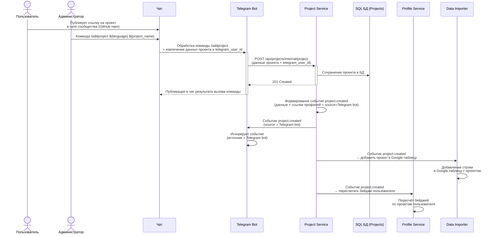
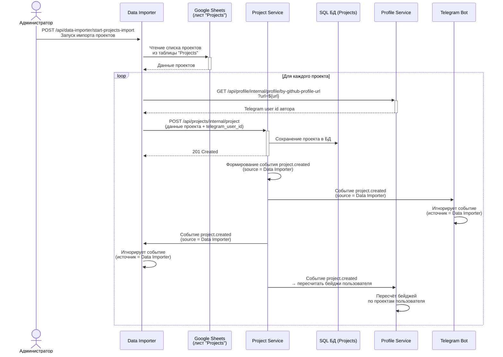

# Системная аналитика - учёт проектов

## Необходимый контекст

- [Бизнес аналитика](https://github.com/it-mentor-community-platform/meta/blob/main/business-analytics/functionality/projects-bookkeeping.md) учёта проектов

## Добавление проекта через Telegram Mini App

### Шаги

- Пользователь добавляет проект через форму в Mini App, указывая ссылку на GitHub репозиторий, язык, какой проекта роадмапа сдаётся, ссылку на деплой (если есть)
- Mini App совершает POST запрос `/api/projects/project`, тело содержит введённые пользователем данные, Telegram user id можно узнать, посмотрев в subject JWT токена. Gateway направляет запрос к Project Service
- Project Service сохраяет проект в свою SQL БД. Дата добавления проекта - текущий момент времени
- Project Service формирует Kafka сообщение для топика `projects.project.created`. Тело содержит введённые пользователем данные, его Telegram user id, ссылки на Telegram и GitHub профили, источник проекта (mini app). Консьюмеры:
  - Telegram Bot формирует Telegram пост и публикует его в чат
  - Data Importer добавляет в Google таблицу новый проект
  - Profile Service пересчитывает бейджи (ачивки) пользователя, связанные с исполнением проектов
 
  ```mermaid
  sequenceDiagram
    participant MiniApp as Mini App
    participant ProjectService as Project Service
    participant SQLDB as SQL БД (Projects)
    participant ProfileService as Profile Service
    participant TelegramBot as Telegram Bot
    participant Chat as Чат
    participant DataImporter as Data Importer

    MiniApp ->>+ ProjectService: POST /api/projects/project<br/>(данные проекта в теле +<br/>telegram_user_id в токене)

    ProjectService ->> SQLDB: Сохранение проекта в БД
    ProjectService -->>- MiniApp: 201 Created

    ProjectService ->> ProjectService: Формирование события project.created<br/>(данные проекта + ссылки профилей + источник проекта)

    ProjectService ->> TelegramBot: Отправка события project.created
    TelegramBot ->> Chat: формирование поста и публикация

    ProjectService ->> DataImporter: Отправка события project.created<br/>→ добавить проект в Google таблицу

    ProjectService ->> ProfileService: Отправка события project.created<br/>→ пересчитать бейджи пользователя
  ```

## Добавление проекта через Telegram Bot

### Шаги

- Пользователь публикует ссылку на проект в чате сообщества, указывая ссылку на GitHub репозиторий
- Администратор вызывает команду `/addproject ${:language} ${:project_name}` 
- В Telegram Bot'е срабатывает handler команды `/addproject` и он вызывает эндпоинт `POST /api/projects/internal/project`, тело содержит введённые пользователем данные и его Telegram user id
- Project Service сохраяет проект в свою SQL БД. Дата добавления проекта - текущий момент времени
- Project Service формирует Kafka сообщение для топика `projects.project.created`. Тело содержит введённые пользователем данные, его Telegram user id, ссылки на Telegram и GitHub профили, источник проекта (Telegram bot). Консьюмеры:
  - Telegram Bot игнорирует сообщение потому что источник проекта - Telegram bot
  - Data Importer добавляет в Google таблицу новый проект
  - Profile Service пересчитывает бейджи (ачивки) пользователя, связанные с исполнением проектов



## Добавление проекта через Data Importer

### Шаги

- Администратор запускает импорт проектов через `POST /api/data-importer/start-projects-import`
- Data Importer читает проекты из [таблицы](https://docs.google.com/spreadsheets/d/1E66YrdvO7B_j0Ykge-JJDMtB1RfKhIzN_SsO7UPDbrU/edit?gid=0#gid=0) (лист "Projects")
- Для каждого проекта, Data Importer делает запрос к Profile Service, чтобы найти пользователя по GitHub профилю - `GET /api/profile/internal/profile/by-github-profile-url?url=${:url}`. Из ответа извлекается Telegram user id автора
- Data Importer вызывает эндпоинт `POST /api/projects/internal/project`, тело содержит введённые пользователем данные и его Telegram user id и timestamp добавления проекта (извлекается из Google таблицы)
- Project Service сохраяет проект в свою SQL БД. Дата добавления проекта - из запроса
- Project Service формирует Kafka сообщение для топика `projects.project.created`. Тело содержит введённые пользователем данные, его Telegram user id, ссылки на Telegram и GitHub профили, источник проекта (Data Importer). Консьюмеры:
  - Telegram Bot игнорирует сообщение потому что источник проекта - Data Importer
  - Data Importer игнорирует сообщение потому что источник проекта - Data Importer
  - Profile Service пересчитывает бейджи (ачивки) пользователя, связанные с исполнением проектов


