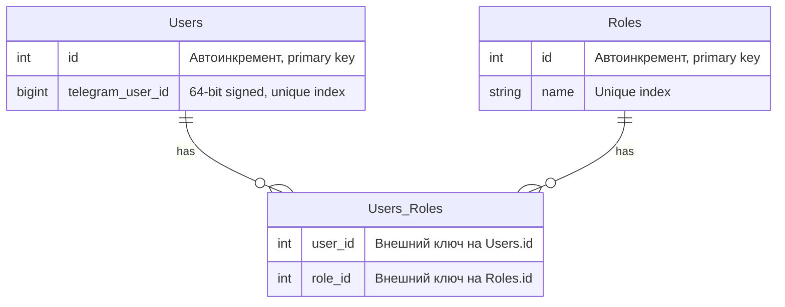

# Auth Service

## Необходимый контекст

- Telegram Mini App init data https://docs.telegram-mini-apps.com/platform/init-data, https://docs.telegram-mini-apps.com/platform/launch-parameters
- JWT (структура, подпись, claims) - https://auth0.com/docs/secure/tokens/json-web-tokens
- [Бизнес аналитика](../../../business-analytics/functionality/authentication-and-authorization.md) аутентификации и авторизации

## Стек

- Spring Boot 3
- Spring Data JDBC
- Liquibase
- JJWT для генерации JWT

## Взаимодействия

Входящие:
- REST эндпоинты

## Схема БД



Дополнение к схеме - необходим unique композитный индекс на колонки `user_id` и `role_id` таблицы `User_Roles`.

Список ролей перечислен в [бизнес аналитике](../../../business-analytics/functionality/authentication-and-authorization.md) аутентификации и авторизации.

## Схема REST API

Для всех методов передаются [кастомные заголовки запроса](https://github.com/it-mentor-community-platform/meta/blob/main/system-analytics/services/gateway/index.md#%D0%BF%D1%80%D0%B0%D0%B2%D0%B8%D0%BB%D0%B0-security) с Telegram Id и ролями пользователя.

### Ответ в случае ошибки

Актуально для всех методов.

Код должен соответствовать ситуации (перечислено ниже), тело:
```
{
  "message": "Текст ошибки"
}
```

### Авторизация через Telegram

`POST /api/auth/by-telegram`

Тело запроса (`Content-Type: application-json`)
```
{
  "initDataRaw": "..."
}
```

Ответ в случае успеха: `200 OK` с JWT токеном, установленном в кастомный заголовок `X-Access-Token`.

Коды ошибок:

- 400 - ошибки валидации
- 500 - неизвестная ошибка

### Авторизация через Dummy метод

`POST /api/auth/by-dummy`

Тело запроса (`Content-Type: application-json`)
```
{
  "user_id": 1, // Users.id, а не Users.telegram_user_id!
  "roles": ["ROLE_1", "ROLE_2"]
}
```

Ответ в случае успеха: `200 OK` с JWT токеном, установленном в кастомный заголовок `X-Access-Token`.

Коды ошибок:

- 400 - ошибки валидации (пример - неизвестные системе роли)
- 500 - неизвестная ошибка

### Внутренний эндпоинт для создания пользователей

Используется при импорте пользователей из Google Spreadsheet.

`POST /api/auth/internal/user`

Тело запроса (`Content-Type: application-json`)
```
{
  "telegram_user_id": 1,
  "roles": ["ROLE_1", "ROLE_2"]
}
```

Ответ в случае успеха: `201 Created`.

Коды ошибок:

- 400 - ошибки валидации (пример - неизвестные системе роли)
- 409 - пользователь с таким telegram user id уже существует
- 500 - неизвестная ошибка
