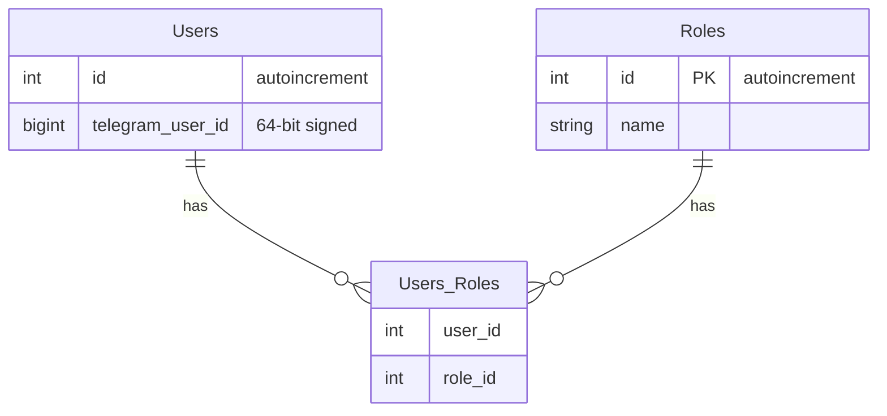

# Auth Service

## Необходимый контекст

- Telegram Mini App init data https://docs.telegram-mini-apps.com/platform/init-data, https://docs.telegram-mini-apps.com/platform/launch-parameters
- JWT (структура, подпись, claims) - https://auth0.com/docs/secure/tokens/json-web-tokens
- [Бизнес аналитика](business-analytics/functionality/authentication-and-authorization.md) аутентификации и авторизации

## Стек

- Spring Boot 3
- Spring Data JDBC
- Liquibase
- JJWT для генерации JWT

## Взаимодействия

Входящие:
- REST эндпоинты

## Схема БД



## Схема REST API

### Ответ в случае ошибки

Актуально для всех методов.

Код должен соответствовать ситуации (перечислено ниже), тело:
```
{
  "message": "Текст ошибки"
}
```

### Авторизация через Telegram

`POST /auth/by-telegram`

Тело запроса (`Content-Type: application-json`)
```
{
  "initDataRaw": "..."
}
```

Ответ в случае успеха: `200 OK` с JWT токеном, установленном в кастомный заголовок `X-Access-Token`.

Коды ошибок:

- 400 - ошибки валидации (пример - слишком короткий username)
- 409 - username занят
- 500 - неизвестная ошибка

### Авторизация через Dummy метод

`POST /auth/by-dummy`

Тело запроса (`Content-Type: application-json`)
```
{
  "user_id": 1,
  "roles": ["ROLE_1", "ROLE_2"]
}
```

Ответ в случае успеха: `200 OK` с JWT токеном, установленном в кастомный заголовок `X-Access-Token`.

Коды ошибок:

- 400 - ошибки валидации (пример - слишком короткий username)
- 409 - username занят
- 500 - неизвестная ошибка
