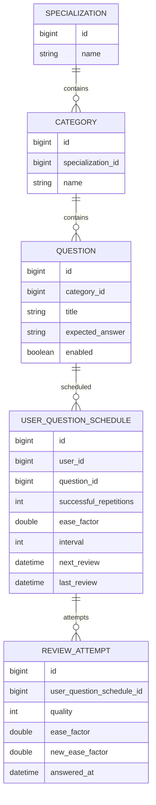

# Interval Repetition Service

## Стек

- Spring Boot 3
- Spring Data JDBC
- Liquibase

## Взаимодействия

Входящие:
- REST эндпоинты

## Схема БД

Индексы:
- Составной индекс на колонки user_id, next_review_at таблицы user_question_schedule для быстрого поиска вопросов пользователя, доступных для повторения, с сортировкой по ближайшей дате следующего показа
- Индекс на колонку category_id таблицы question для быстрого получения вопросов определенной категории
- Индекс на колонку user_question_schedule_id таблицы review_attempt для получения истории попыток повторения конкретного состояния вопроса пользователя
- Unique составной индекс на колонки user_id, question_id таблицы user_question_schedule для гарантии уникальности состояния повторения вопроса для пользователя 

## Схема REST API

TODO
