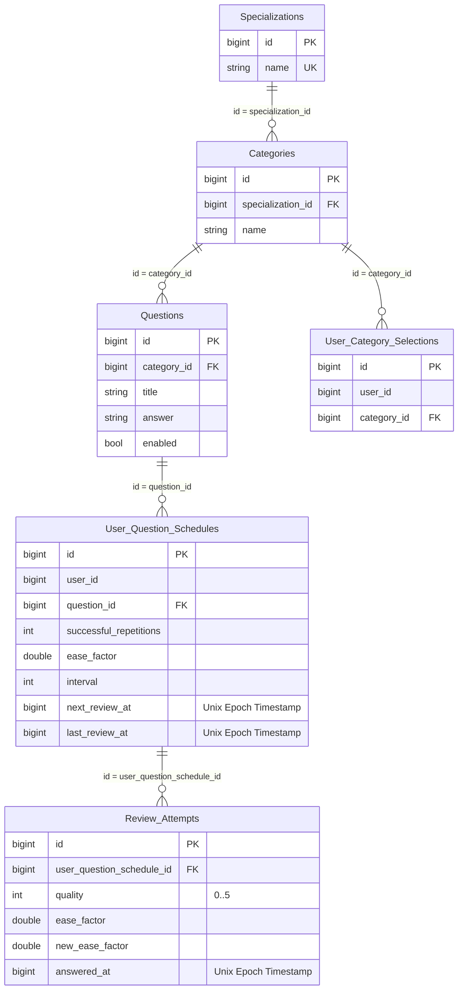

# Interval Repetition Service

## Стек

- Spring Boot 3
- Spring Data JDBC
- Liquibase

## Взаимодействия

Входящие:
- REST эндпоинты

## Схема БД


Индексы:
- `Categories` - индекс на значение `specialization_id` для быстрого получения категорий специализации
- `User_Category_Selections` - уникальный композитный индекс на комбинацию значений `user_id`, `category_id` для гарантии уникальности выбранной пользователем категории
- `User_Category_Selections` - индекс на значение `user_id` для быстрого получения выбранных категорий
- `Questions` - индекс на значение `category_id` для быстрого получения вопросов определенной категории
- `User_Question_Schedules` - уникальный композитный индекс на комбинацию значений `user_id`, `question_id` для гарантии уникальности состояния повторения вопроса для пользователя
- `User_Question_Schedules` - композитный индекс на комбинацию значений `user_id`, `next_review_at` для быстрого поиска вопросов пользователя, доступных для повторения, с сортировкой по ближайшей дате следующего показа
- `Review_Attempts` - индекс на значение `user_question_schedule_id` для быстрого получения истории попыток повторения конкретного состояния вопроса пользователя
  
## Схема REST API

Для всех методов передаются [кастомные заголовки запроса](https://github.com/it-mentor-community-platform/meta/blob/main/system-analytics/services/gateway/index.md#%D0%BF%D1%80%D0%B0%D0%B2%D0%B8%D0%BB%D0%B0-security) с Telegram Id и ролями пользователя (но принимаются только необходимые в рамках конкретного запроса).

### Ответ в случае ошибки

Актуально для всех методов.

Код должен соответствовать ситуации (перечислено ниже), тело:
```
{
  "message": "Текст ошибки"
}
```

### Внутренний эндпоинт для импорта вопроса
`POST /api/interval-repetition/internal/question`

Используется для загрузки вопросов из Google Spreadsheet. Вопрос идентифицируется по title. Если вопрос не существует в бд, то добавляется с помощью INSERT, иначе вызывается UPDATE.

Специализации и темы добавляются вместе с вопросом, если ещё не существуют.

Тело запроса (`Content-Type: application-json`)
```
{
  "specialization": "Java",
  "category": "Java Core",
  "title": "Какие типы ссылок существуют в Java?",
  "answer": "Сильная ссылка...",
}
```

Ответ в случае успеха: `200 OK` 

Тело ответа (`Content-Type: application-json`)
```
{
  "question": {
    "id": 1,
    "categoryId": 1,
    "title": "Какие типы ссылок существуют в Java?",
    "answer": "Сильная ссылка...",
    "enabled": true
  },
  "category": {
    "id": 1,
    "specializationId": 1,
    "name": "Java Core"
  },
  "specialization": {
    "id": 1,
    "name": "Java"
  }
}
```


Коды ошибок:

- `400` - ошибки валидации.
- `500` - неизвестная ошибка.

### Получение всех специализаций и категорий

`GET /api/interval-repetition/specializations`

Возвращает список всех специализаций с вложенными категориями.

Для каждой категории возвращаются метрики вопросов и признак того, выбрана ли категория пользователем для повторения.

Ответ в случае успеха: `200 OK`. 

Тело ответа (`Content-Type: application-json`)

```
[
  {
    "id": 1,
    "name": "Java Backend",
    "categories": [
      {
        "id": 1,
        "name": "Java Core",
        "selected": true,
        "new_questions": 12,
        "questions_ready_to_repeat": 40,
        "all_questions": 200
      },
      {
        "id": 2,
        "name": "Collections",
        "selected": false,
        "new_questions": 0,
        "questions_ready_to_repeat": 10,
        "all_questions": 130
      }
    ]
  },
  {
    "id": 2,
    "name": "Python Backend",
    "categories": [
      {
        "id": 4,
        "name": "Python Core",
        "selected": false,
        "new_questions": 20,
        "questions_ready_to_repeat": 5,
        "all_questions": 100
      }
    ]
  }
]
```

Коды ошибок:

- `500` - неизвестная ошибка

### Сохранение выбранных категорий
`POST /api/interval-repetition/selected-categories`

Пользователь может сформировать набор категорий, которые он планирует повторять.

Набор категорий является изменяемым: пользователь может добавлять и удалять категории в любой момент.


Тело запроса (`Content-Type: application/json`):

```
{
  "categoryIds": [1, 2, 3]
}
```

Сервис сохраняет выбранные категории пользователя в `user_category_selection`.

Ответ в случае успеха: `201 Created`. 
Тело ответа (`Content-Type: application-json`)

```
[
  {
    "id": 1,
    "name": "Java Core",
    "specialization": "Java Backend"
  },
  {
    "id": 2,
    "name": "Collections",
    "specialization": "Java Backend"
  },
  {
    "id": 3,
    "name": "OOP",
    "specialization": "Java Backend"
  }
]
```

Коды ошибок:

- `400` - ошибки валидации.
- `404` - категория не найдена
- `409` - категория уже добавлена
- `500` - неизвестная ошибка

### Получение выбранных категорий

`GET /api/interval-repetition/selected-categories`

Возвращает список категорий, выбранных пользователем для повторения.

Для каждой категории отображается:

- количество новых вопросов;
- количество вопросов, доступных для повторения прямо сейчас;
- общее количество вопросов.

Ответ в случае успеха: `200 OK`. 
Тело ответа (`Content-Type: application-json`)
```
[
  {
    "id": 1,
    "name": "Java Core",
    "specialization": "Java Backend",
    "new_questions": 12,
    "questions_ready_to_repeat": 40,
    "all_questions": 200
  },
  {
    "id": 2,
    "name": "Collections",
    "specialization": "Java Backend",
    "new_questions": 0,
    "questions_ready_to_repeat": 10,
    "all_questions": 130
  },
  {
    "id": 3,
    "name": "OOP",
    "specialization": "Java Backend",
    "new_questions": 5,
    "questions_ready_to_repeat": 15,
    "all_questions": 80
  }
]
```

Коды ошибок:

- `500` - неизвестная ошибка

### Удаление выбранной категории

`DELETE /api/interval-repetition/selected-categories/{categoryId}`

Удаляет категорию из набора выбранных категорий пользователя.

Ответ в случае успеха: `204 No Content`.

Коды ошибок:

- `400` - ошибки валидации.
- `404` - категория не найдена
- `500` - неизвестная ошибка

### Получение следующего вопроса из всех выбранных категорий

`GET /api/interval-repetition/selected-categories/next-question`

Возвращает следующий доступный вопрос из выбранных пользователем категорий.

Ответ в случае успеха: 
-  `200 OK` - есть вопрос

Тело ответа (`Content-Type: application-json`)

```
{
  "questionId": 123,
  "categoryId": 2,
  "title": "Как устроен HashMap в Java?",
  "answer": "Бакеты...",
  "questions_left": 32
}
```
- `204` - нет доступных вопросов

Коды ошибок:

- `500` - неизвестная ошибка

### Получение следующего вопроса из конкретной категории

`GET /api/interval-repetition/categories/{categoryId}/next-question`

Возвращает следующий доступный вопрос из указанной категории.

Ответ в случае успеха: 
-  `200 OK` - есть вопрос

Тело ответа (`Content-Type: application-json`)

```
{
  "questionId": 123,
  "categoryId": 2,
  "title": "Как устроен HashMap в Java?",
  "answer": "Бакеты...",
  "questions_left": 32
}
```
- `204` - нет доступных вопросов

Коды ошибок:

- `400` - ошибки валидации.
- `404` - категория не найдена
- `500` - неизвестная ошибка

### Оценка ответа на вопрос

Пользователь самостоятельно оценивает свой ответ после просмотра вопроса.

`POST /api/interval-repetition/review-attempt`

Тело запроса (`Content-Type: application/json`):

```
{
  "questionId": 123,
  "quality": 4
}
```

Ответ в случае успеха: `200 OK`.

Коды ошибок:

- `400` - ошибки валидации 
- `404` - вопрос не найден
- `500` - неизвестная ошибка

### Получение категории и её вопросов

`GET /api/interval-repetition/categories/{categoryId}`

Возвращает данные категории, метрики вопросов и список всех вопросов этой категории.

Для категории возвращается:

- количество новых вопросов;
- количество вопросов, доступных для повторения прямо сейчас;
- общее количество вопросов.

Для каждого вопроса возвращается ответ и дата следующего повторения пользователя.

Ответ в случае успеха: `200 OK`. 
Тело ответа (`Content-Type: application-json`)
```
{
  "id": 2,
  "name": "Collections",
  "specialization": "Java Backend",
  "new_questions": 5,
  "questions_ready_to_repeat": 15,
  "all_questions": 80,
  "questions": [
    {
      "id": 1,
      "title": "Что такое HashMap?",
      "answer": "HashMap - это...",
    },
    {
      "id": 2,
      "title": "Сложность поиска по индексу в ArrayList",
      "answer": "O(1)",
    }
  ]
}
```

Коды ошибок:

- `400` - ошибки валидации.
- `404` - категория не найдена
- `500` - неизвестная ошибка


