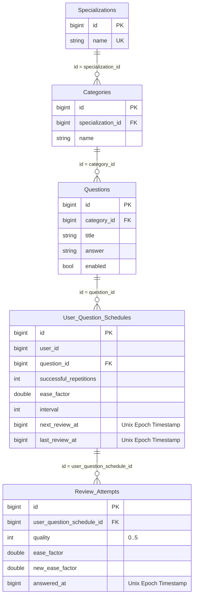

# Interval Repetition Service

## Стек

- Spring Boot 3
- Spring Data JDBC
- Liquibase

## Взаимодействия

Входящие:
- REST эндпоинты

## Схема БД


Индексы:
- Составной индекс на колонки user_id, next_review_at таблицы user_question_schedule для быстрого поиска вопросов пользователя, доступных для повторения, с сортировкой по ближайшей дате следующего показа
- Индекс на колонку category_id таблицы question для быстрого получения вопросов определенной категории
- Индекс на колонку user_question_schedule_id таблицы review_attempt для получения истории попыток повторения конкретного состояния вопроса пользователя
- Unique составной индекс на колонки user_id, question_id таблицы user_question_schedule для гарантии уникальности состояния повторения вопроса для пользователя 

## Схема REST API

### Внутренний эндпоинт для импорта вопроса

Используется для загрузки вопросов из Google Spreadsheet. Вопрос идентифицируется по title. Если вопрос не существует в бд, то добавляется с помощью INSERT, иначе вызывается UPDATE.

Специализации и темы добавляются вместе с вопросом, если ещё не существуют.

`POST /api/interval-repetition/internal/question`

Тело запроса (`Content-Type: application-json`)
```
{
  "specialization": "Java",
  "category": "Java Core",
  "title": "Какие типы ссылок существуют в Java?",
  "answer": "Сильная ссылка...",
}
```

Ответ в случае успеха: `200 OK` 

Тело ответа (`Content-Type: application-json`)
```
{
  "question": {
    "id": 1,
    "categoryId": 1,
    "title": "Какие типы ссылок существуют в Java?",
    "answer": "Сильная ссылка...",
    "enabled": true
  },
  "category": {
    "id": 1,
    "specializationId": 1,
    "name": "Java Core"
  },
  "specialization": {
    "id": 1,
    "name": "Java"
  }
}
```


В случае ошибок:

- 400 Bad Request — ошибки валидации.
- 500 Internal Server Error — неизвестная ошибка.

Тело ответа при ошибке (`Content-Type: application-json`)

```
{
  "message": "Validation failed..."
}
```
