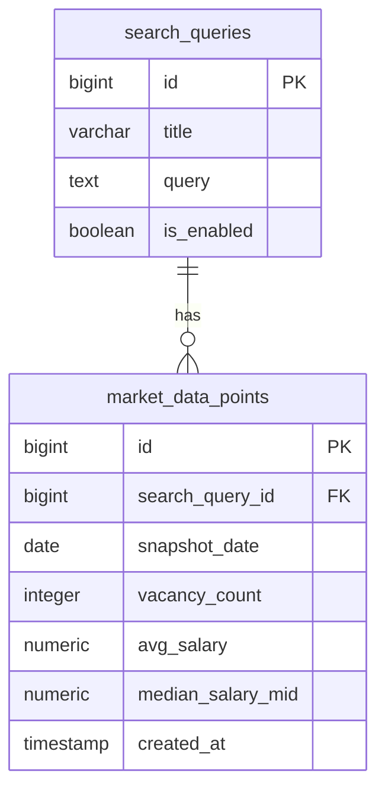

# Job Market Analytics Service

## Контекст

- [Бизнес аналитика](https://github.com/it-mentor-community-platform/meta/blob/main/business-analytics/functionality/job-market-analytics.md)

## Стек

- Spring Boot 3
- Spring Data JDBC
- Spring Kafka
- Liquibase

## Взаимодействия

Входящие:
- REST эндпоинты
- Kafka

Исходящие:
- API headhunter.ru

## Схема БД



Индексы:
- `market_data_points` - композитный `UNIQUE` на пару значений `search_query_id`, `snapshot_date`

## Схема REST API

Для всех методов передаются [кастомные заголовки запроса](https://github.com/it-mentor-community-platform/meta/blob/main/system-analytics/services/gateway/index.md#%D0%BF%D1%80%D0%B0%D0%B2%D0%B8%D0%BB%D0%B0-security) с Telegram Id и ролями пользователя (но принимаются только необходимые в рамках конкретного запроса). 

Формат адресов запроса - `/api/имя сервиса/эндпоинт`.

Управление (создание, редактирование) поисковыми запросами доступно только пользователям с ролью `ADMIN`.

---

### Ответ в случае ошибки

Актуально для всех методов.

Код должен соответствовать ситуации (перечислено ниже), тело:

```
{
  "message": "Текст ошибки"
}
```

### Эндпоинт для создания поискового запроса

`POST /api/job-market-analytics/search-query`

Тело запроса (`Content-Type: application/json`):

```
{
  "title": "Java Developer",
  "query": "NAME:(!"Java") NOT QA NOT AQA",
  "isEnabled": true
}
```

Ответ в случае успеха: `201 Created`.

Тело ответа:

```
{
  "id": 1,
  "title": "Java Developer",
  "query": "NAME:(!"Java") NOT QA NOT AQA",
  "isEnabled": true
}
```

Коды ошибок:

- 400 - ошибки валидации
- 403 - недостаточно прав
- 409 - поисковый запрос с таким `title` уже существует
- 500 - неизвестная ошибка

### Эндпоинт для редактирования поискового запроса

`PUT /api/job-market-analytics/search-query/{id}`

Тело запроса (`Content-Type: application/json`):

```
{
  "title": "Java Developer",
  "query": "NAME:(!"Java") NOT QA NOT AQA",
  "isEnabled": true
}
```

Ответ в случае успеха: `200 OK`.

Коды ошибок:

- 400 - ошибки валидации
- 403 - недостаточно прав
- 404 - поисковый запрос не найден
- 500 - неизвестная ошибка

### Эндпоинт для получения списка поисковых запросов

`GET /api/job-market-analytics/search-queries`

Доступно без авторизации.

GET Параметры:

- `isEnabled` — optional, фильтр по признаку активности

Пример:

`GET /api/job-market-analytics/search-query?isEnabled=true`

Ответ в случае успеха: `200 OK`.

Тело ответа:

```
[
  {
    "id": 1,
    "title": "Java Developer",
    "query": "NAME:(!"Java") NOT QA NOT AQA",
    "isEnabled": true
  },
  {
    "id": 2,
    "title": "Python Developer",
    "query": "Name:(python or django or drf or backend or fastapi or flask) and DESCRIPTION:(django or drf or fastapi or flask)",
    "isEnabled": true
  }
]
```

Коды ошибок:

- 400 - невалидное значение query param
- 500 - неизвестная ошибка

### Эндпоинт для получения списка датапоинтов по заданному поисковому запросу

`GET /api/job-market-analytics/data-points`

Полученых исторических data points для построения графиков по одному поисковому запросу за данный период.

GET параметры:
- `searchQueryId` - айди поискового запроса
- `from` — дата YYYY-MM-DD (включительно)
- `to` — дата YYYY-MM-DD (включительно). Если не передана — подразумевается текущая дата

Примеры:

- `/api/job-market-analytics/data-points?searchQueryId=1&from=2026-01-01&to=2026-03-01`
- `/api/job-market-analytics/data-points?searchQueryId=1&from=2026-01-01`

Ответ в случае успеха: `200 OK`.

Тело ответа:

```
[
  {
    "date": "01.01.2023",
    "vacancyCount": 123,
    "averageSalary": 12.34
  },
  {
    "date": "02.01.2023",
    "vacancyCount": 124,
    "averageSalary": 12.35
  }
]
```
