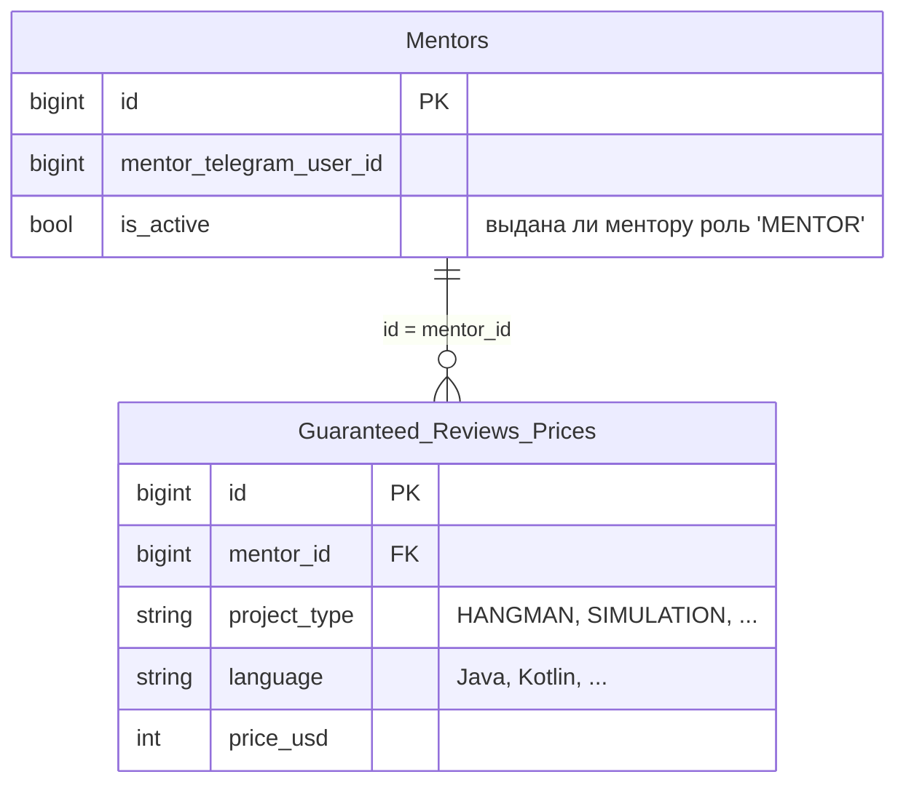

# Mentor Service

## Стек

- Spring Boot 3
- Spring Data JDBC
- Liquibase

## Взаимодействия

Входящие:
- REST эндпоинты

## Схема БД

Индексы:
- Уникальный композитный индекс на комбинацию значений `mentor_id`, `project_type`, `language` 
