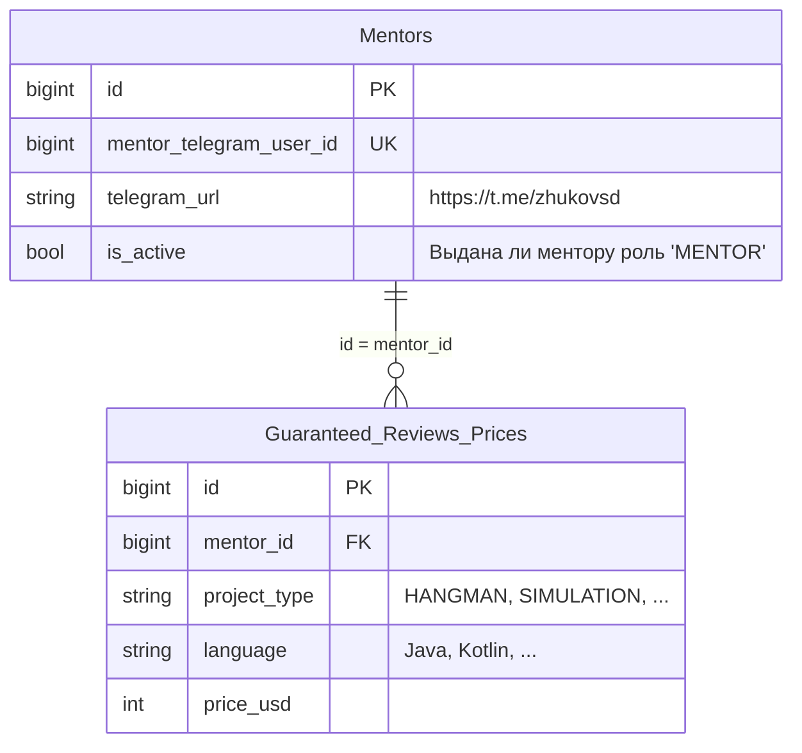

# Mentor Service

## Стек

- Spring Boot 3
- Spring Data JDBC
- Liquibase

## Взаимодействия

Входящие:
- REST эндпоинты
- Kafka

## Схема БД



Индексы:
- Уникальный индекс на значение `mentor_telegram_user_id` для проверки уникальности ментора
- Уникальный композитный индекс на комбинацию значений `mentor_id`, `project_type`, `language` 

## Схема REST API

Для всех методов передаются [кастомные заголовки запроса](https://github.com/it-mentor-community-platform/meta/blob/main/system-analytics/services/gateway/index.md#%D0%BF%D1%80%D0%B0%D0%B2%D0%B8%D0%BB%D0%B0-security) с Telegram Id и ролями пользователя.

### Ответ в случае ошибки

Актуально для всех методов.

Код должен соответствовать ситуации (перечислено ниже), тело:
```
{
  "message": "Текст ошибки"
}
```

### Внутренний эндпоинт для добавления цены на гарантированное ревью из Data Importer

`POST /api/mentor/internal/guaranteed-review`

Тело запроса (`Content-Type: application-json`):

```
{
  "telegram_url": "https://t.me/zhukovsd",
  "language": "Java",
  "project_type": "SIMULATION",
  "price_usd": 15
}
```

Ответ в случае успеха: `201 Created` если цена была создава, `200 OK` если обновлена.

Коды ошибок:

- 400 - ошибки валидации (невалидный тип проекта, невалидная ссылка на Telegram профиль)
- 500 - неизвестная ошибка
- 404 - ментор не найден в profile service по ссылке на Telegram профиль 

## Kafka

### Consumer для топика `auth.user.updated`

Consumer group - `mentor-service-cg`.

Используется для актуализации поля `is_active` в таблице `Mentors`. Если у пользователя есть роль `MENTOR`, `is_mentor` присваивается значение `true`.

Payload сообщения - https://github.com/it-mentor-community-platform/meta/blob/main/system-analytics/services/auth-service/index.md#producer-%D0%B4%D0%BB%D1%8F-%D1%82%D0%BE%D0%BF%D0%B8%D0%BA%D0%B0-authuserupdated
