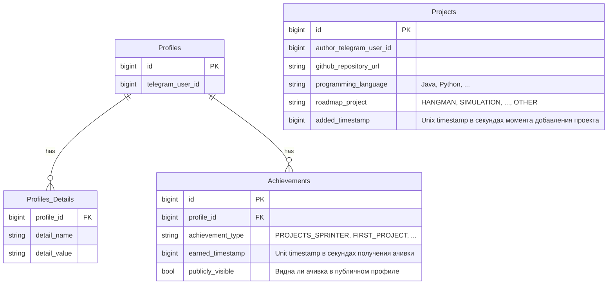

# Profile Service

## Стек

- Spring Boot 3
- Spring Data JDBC
- Spring Kafka
- Liquibase

## Взаимодействия

Входящие:
- REST эндпоинты
- Kafka

## Схема БД



Индексы:
- Unique композитный индекс на колонки `details_name`, `detail_value` таблицы `Profiles_Details`
- Индекс по `Projects.author_telegram_user_id` для поиска проектов по автору
- Unique индекс на `Projects.github_repository_url` для проверки уникальности проекта
- Unique составной индекс на колонки `profile_id`, `achievement_type` таблицы `Achievements` 

## Схема REST API

Для всех методов передаются [кастомные заголовки запроса](https://github.com/it-mentor-community-platform/meta/blob/main/system-analytics/services/gateway/index.md#%D0%BF%D1%80%D0%B0%D0%B2%D0%B8%D0%BB%D0%B0-security) с Telegram Id и ролями пользователя.

### Ответ в случае ошибки

Актуально для всех методов.

Код должен соответствовать ситуации (перечислено ниже), тело:
```
{
  "message": "Текст ошибки"
}
```

### Получение профиля текущего пользователя

`GET /api/profile`

Ответ в случае успеха: `200 OK`. Тело:

```
{
  "github_profile_url": "https://github.com/zhukovsd",
  "telegram_url": "https://t.me/zhukovsd"
}
```

Коды ошибок:

- 500 - неизвестная ошибка
- 404 - отсутствие профиля для текущего пользователя

### Обновление профиля текущего пользователя

Метод поддерживает передачу одного или нескольких полей профиля.

`PATCH /api/profile`

Тело запроса (`Content-Type: application-json`)
```
{
  "github_profile_url": "..."
}
```

Валидация:
- Ссылка на GitHub профиль должна начинаться с "https://github.com/" и содержать валидный GitHub username после последнего слеша
- Ссылка на Telegram профиль должна начинаться с "https://t.me/" и содержать валидный Telegram username после последнего слеша

Ответ в случае успеха: `200 OK`. Тело - текущее состояние профиля пользователя (со всеми полями, а не только теми, что были переданы в PATCH запросе).

Коды ошибок:

- 400 - ошибки валидации (невалидные поля или значения)
- 404 - профиль текущего пользователя не существует
- 500 - неизвестная ошибка

### Внутренний эндпоинт для импорта профилей

Используется при импорте пользователей из Google Spreadsheet. Поддерживает создание и обновление профиля с деталями.

`POST /api/profile/internal/profile`

Тело запроса (`Content-Type: application-json`)
```
{
  "telegram_user_id": 1,
  "details": {
    "github_profile": "https://github.com/zhukovsd",
    "telegram_url": "https://t.me/zhukovsd"
  }
}
```

Ответ в случае успеха: `201 Created` если профиль был создан, `200 OK` если профиль был обновлён.

Коды ошибок:

- 400 - ошибки валидации (невалидные поля)
- 500 - неизвестная ошибка

### Внутренний эндпоинт поиска профиля по ссылке на GitHub аккаунт

`GET /api/profile/internal/profile/by-github-profile-url?url=${:url}`

Ответ в случае успеха: `200 OK`, тело:

```
{
  "telegram_user_id": 1,
  "details": {
    "github_profile": "https://github.com/zhukovsd",
    "telegram_url": "https://t.me/zhukovsd"
  }
}
```

Коды ошибок:

- 400 - ошибки валидации запроса (например, переданная ссылка не является ссылкой на GitHub профиль)
- 500 - неизвестная ошибка
- 404 - профиль не найден

## Kafka

### Consumer для топика `auth.user.created`

Используется для иницилизации профиля пользователя в таблице `Profiles`.

Payload сообщения:
```
{
  "telegram_user_id": bigint
}
```

### Consumer для топика `projects.project.created`

Consumer group - `profile-service-cg`.

[Описание формата](https://github.com/it-mentor-community-platform/meta/blob/main/system-analytics/services/project-service/index.md#producer-%D0%B4%D0%BB%D1%8F-%D1%82%D0%BE%D0%BF%D0%B8%D0%BA%D0%B0-projectsprojectcreated) сообщения.
