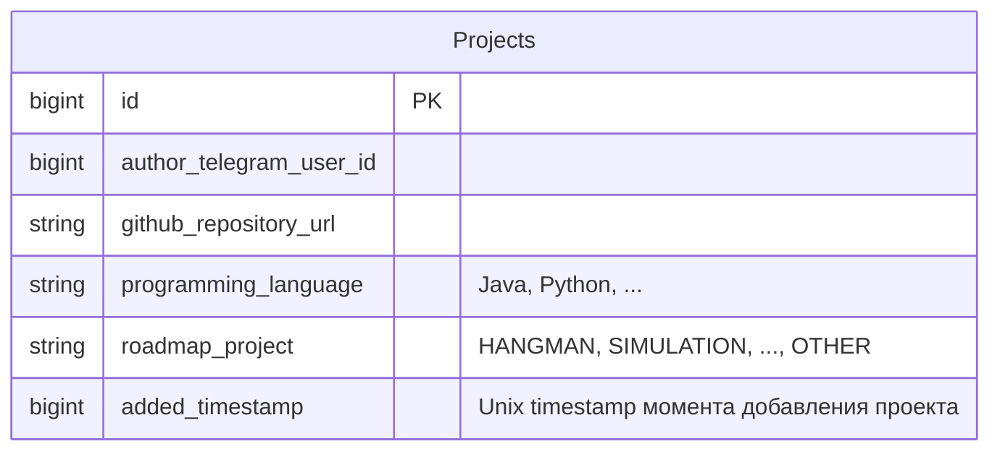

# Project Service

## Стек

- Spring Boot 3
- Spring Data JDBC
- Spring Kafka
- Liquibase

## Взаимодействия

Входящие:
- REST эндпоинты

Исходящие:
- REST вызовы
- Kafka

## Схема БД



Индексы:
- Индекс по `author_telegram_user_id` для поиска проектов по автору
- Unique индекс на `github_repository_url` для проверки уникальности проекта

## Схема REST API

Для всех методов передаются [кастомные заголовки запроса](https://github.com/it-mentor-community-platform/meta/blob/main/system-analytics/services/gateway/index.md#%D0%BF%D1%80%D0%B0%D0%B2%D0%B8%D0%BB%D0%B0-security) с Telegram Id и ролями пользователя.

### Ответ в случае ошибки

Актуально для всех методов.

Код должен соответствовать ситуации (перечислено ниже), тело:
```
{
  "message": "Текст ошибки"
}
```

### Добавление проекта пользователем с фронтенда

`POST /api/projects/project`

[Системная аналитика](https://github.com/it-mentor-community-platform/meta/blob/main/system-analytics/functionality/projects-bookkeeping.md#%D0%B4%D0%BE%D0%B1%D0%B0%D0%B2%D0%BB%D0%B5%D0%BD%D0%B8%D0%B5-%D0%BF%D1%80%D0%BE%D0%B5%D0%BA%D1%82%D0%B0-%D1%87%D0%B5%D1%80%D0%B5%D0%B7-telegram-mini-app) по тому, что делает эндпоинт.

Тело запроса:

```
{
  "github_repository_url": "https://github.com/zhukovsd/simulation",
  "programming_language": "Java",
  "roadmap_project": "SIMULATION"
}
```

Telegram id автора знаем из заголовка.

Ответ в случае успеха: `201 Created`. Тело:

```
{
  "id": 0,
  "author_telegram_user_id": 123,
  "github_repository_url": "https://github.com/zhukovsd/simulation",
  "programming_language": "Java",
  "roadmap_project": "SIMULATION",
  "added_timestamp:" 123
}
```

Коды ошибок:

- 500 - неизвестная ошибка
- 400 - невалидное тело запроса (включая неизвестный тип проекта роадмапа)
- 409 - проект по данной ссылке на репозиторий уже существует

### Внутренний эндпоинт для добавленяи проекта из Telegram бота или Data Importer

`POST /api/projects/internal/project`

[Системная аналитика](https://github.com/it-mentor-community-platform/meta/blob/main/system-analytics/functionality/projects-bookkeeping.md#%D1%81%D0%B8%D1%81%D1%82%D0%B5%D0%BC%D0%BD%D0%B0%D1%8F-%D0%B0%D0%BD%D0%B0%D0%BB%D0%B8%D1%82%D0%B8%D0%BA%D0%B0---%D1%83%D1%87%D1%91%D1%82-%D0%BF%D1%80%D0%BE%D0%B5%D0%BA%D1%82%D0%BE%D0%B2) по тому, что делает эндпоинт. Сценарии - добавление через Telegram бот и Data Importer.

Тело запроса:
```
{
  "author_telegram_user_id": 123,
  "github_repository_url": "https://github.com/zhukovsd/simulation",
  "programming_language": "Java",
  "roadmap_project": "SIMULATION",
  "telegram_user_id": 123,
  "telegram_username": "zhukovsd,
  "added_timestamp:" 123, // опциональный параметр
  "projeсt_source_type": "FRONTEND" // FRONTEND, TELEGRAM_BOT, DATA_IMPORTER
}
```

Ответ в случае успеха: `201 Created`. Тело ответа такое же, как у `POST /api/projects/project`.

Коды ошибок:

- 500 - неизвестная ошибка
- 400 - невалидное тело запроса (включая неизвестный тип проекта роадмапа)
- 409 - проект по данной ссылке на репозиторий уже существует

## Kafka

### Producer для топика `projects.project.created`

Используется для уведомления других сервисов о создании нового проекта.

Payload сообщения:
```
{
  "author_telegram_user_id": 123,
  "author_telegram_profile_url": "https://t.me/zhukovsd"
  "github_repository_url": "https://github.com/zhukovsd/simulation",
  "programming_language": "Java",
  "roadmap_project": "SIMULATION",
  "added_timestamp:" 123,
  "projeсt_source_type": "FRONTEND" // FRONTEND, TELEGRAM_BOT, DATA_IMPORTER
}
```
