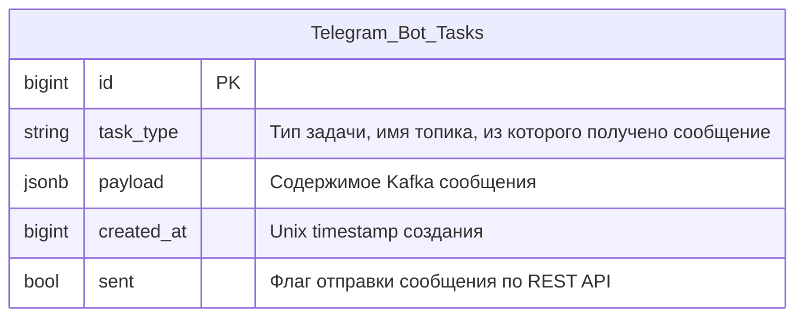

# Telegram Bot Adapter

## Контекст

- [Системная аналитика](https://github.com/it-mentor-community-platform/meta/blob/main/system-analytics/telegram-bot-integration.md) интеграции нашего бэкенда с Telegram ботом сообщества

## Стек

- Kotlin
- Spring Boot 3
- Spring Data JDBC
- Spring Kafka
- Liquibase

## Взаимодействия

Входящие:
- REST эндпоинты
- Kafka

## Схема БД



Индексы:
- Индекс по `sent` для выборки необработанных сообщений

## Схема REST API

Авторизация REST API данного сервиса работает не через JWT, а через basic auth. Логин и пароль для валидации доступа выставляются через конфиг профиля.

### Ответ в случае ошибки

Актуально для всех методов.

Код должен соответствовать ситуации (перечислено ниже), тело:
```
{
  "message": "Текст ошибки"
}
```

### Получение сообщений на обработку

`GET /api/telegram-bot-adapter/tasks?count=${:count}`

`count` - количество запрашиваемые задач. От 1 до 10 включительно. 

Несмотря на метод `GET`, метод не идемпотентный, этим мы немного нарушаем принципы REST.

Эндпоинт запрашивает `count` необработанных сообщений и помечает отправленные сообщения флагом `sent=true` в БД.

Коды ошибок:

- 401 - невалидная авторизация

Ответ в случае успеха: `200 OK`. Тело:

```
{
  "count": 1,
  "tasks:" [
    {
      "task_type": "projects.project.created",
      "payload": {
        // ...
      }
    }
  ]
}
```

Если необработанных сообщений нет, `count` в ответе равен 0, а `tasks` - пустой массив. Важно соблюсти атомарность выборки записей их апдейта как sent, чтобы избежать race condition.

## Kafka

### Consumer для `projects.project.created`

Используется для уведомления других сервисов о создании нового проекта.

Payload сообщения - https://github.com/it-mentor-community-platform/meta/blob/main/system-analytics/services/project-service/index.md#producer-%D0%B4%D0%BB%D1%8F-%D1%82%D0%BE%D0%BF%D0%B8%D0%BA%D0%B0-projectsprojectcreated
